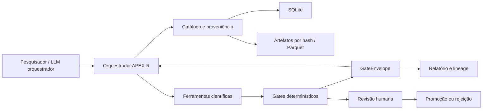
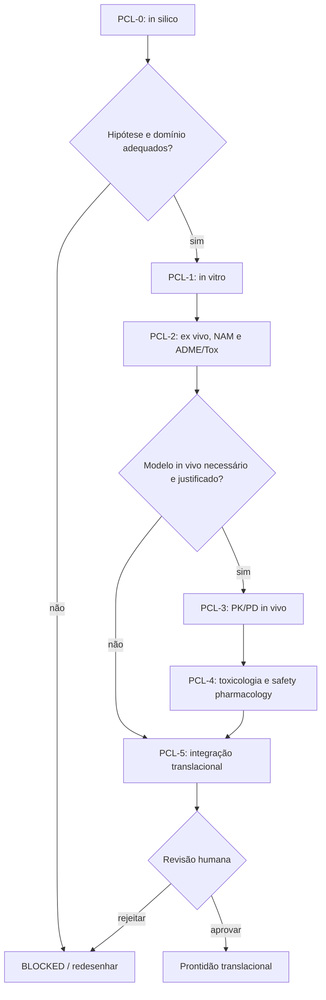

# APEX-R Scientific — Especificação normativa

> Versão da especificação: 0.1-draft  
> Escopo: ferramenta de pesquisa in silico, pré-clínica e translacional  
> Documento complementar: [INVENTARIO.md](./INVENTARIO.md)

## 1. Linguagem normativa

Os termos **DEVE**, **NÃO DEVE**, **OBRIGATÓRIO**, **RECOMENDADO**, **PODE** e **OPCIONAL** são usados no sentido de RFC 2119.

O APEX-R Scientific NÃO DEVE produzir prescrição, recomendação de uso humano, diagnóstico, liberação de lote, autorização de estudo ou conclusão regulatória. O sistema PODE produzir evidência computacional para revisão por pesquisadores qualificados.

## 2. Princípios invariantes

1. **LLM não calcula:** o LLM orquestra; ferramentas versionadas produzem números.
2. **Fail-closed:** dado, unidade, licença, domínio ou evidência ausente resulta em `BLOCKED`/`FAILED`, não em estimativa silenciosa.
3. **Imutabilidade:** datasets e artefatos usados em uma execução são identificados por hash e nunca sobrescritos.
4. **Proveniência total:** todo valor científico deve ser rastreável até fonte, protocolo, transformação e código.
5. **Tipagem física:** grandezas incompatíveis não compilam.
6. **Separação de evidência:** verificação sintética, validação interna, pré-clínica e clínica são estados diferentes.
7. **Incerteza obrigatória:** coeficiente sem incerteza deve ser explicitamente rotulado como fixo/normativo ou incompleto.
8. **Sem promoção automática:** sincronização e recalibração geram candidatos; promoção exige revisão humana.
9. **Reprodutibilidade:** resultados manuais não são copiados para relatórios finais.
10. **Autoridade matemática:** o documento técnico corrigido prevalece sobre auditorias e consolidados anteriores quando houver conflito.
11. **Fórmula como contrato:** expressão, unidades, hipóteses, domínio, fonte, implementação e evidência são versionados em conjunto.
12. **DSM causal tipado:** nós e hiperarestas não podem participar de previsão ou otimização sem semântica causal, temporal e dimensional explícita.

### 2.1 Registro de fórmulas

O arquivo `FORMULAS.md` e o módulo `apex_r.formula_registry` formam o registro normativo
executável. Nenhuma constante empírica pode aparecer em uma equação de produção sem
`coefficient_id`, dataset, split, método, incerteza e decisão de promoção.

Os estados `TESTED`, `REPRODUCED` e `EXTERNALLY_VALIDATED` não são sinônimos. Um teste
unitário prova somente a propriedade declarada no domínio do teste.
10. **Pesquisa responsável:** estudos animais devem demonstrar relevância, 3Rs, governança e qualidade de desenho.

## 3. Escopo funcional

### 3.1 Incluído

- configuração, proveniência e catálogo de dados;
- normalização de entidades, unidades e medições;
- ajuste e validação de coeficientes;
- M0–M11 conforme o inventário;
- evidência pré-clínica PCL-0–PCL-5;
- CLI, biblioteca Python, notebooks consumidores e MCP;
- armazenamento SQLite + Parquet + artefatos por hash;
- relatórios auditáveis e governança de claims.

### 3.2 Fora do escopo inicial

- execução de docking, dinâmica molecular ou softwares comerciais embutidos;
- substituição de revisão científica, ética ou regulatória;
- ingestão automática de prontuário ou dados pessoais identificáveis;
- transporte MCP remoto antes do threat model e autenticação;
- alegações formais de APEX-Lang sem prova implementada;
- promoção de modelo com base somente em dados sintéticos.

## 4. Arquitetura



Camadas:

1. **Contracts:** tipos, estados, schemas e unidades.
2. **Data:** fontes, snapshots, normalização e datasets.
3. **Science:** modelos M0–M11 e perfil pré-clínico.
4. **Validation:** métricas, splits, gates e claims.
5. **Orchestration:** CLI, MCP, triggers e sandbox.
6. **Persistence:** SQLite, Parquet e content-addressed store.
7. **Presentation:** JSON, Markdown e notebooks.

## 5. Contratos públicos

### 5.1 `GateEnvelope`

```yaml
schema_version: "1.0"
run_id: "uuid"
gate_id: "string"
module: "M0|M1|M2|M2.5|M3|M4|M5A|M5B|M6|M7|M8|M9|M10|M11|PCL"
status: "QUEUED|RUNNING|PASSED|FAILED|BLOCKED|NEEDS_REVIEW|SKIPPED|INVALIDATED"
passed: false
reasons: []
metrics: {}
evidence_ids: []
artifact_refs: []
upstream_ids: []
applicability_domain: {}
next_actions: []
created_at: "RFC3339 UTC"
tool_version: "semver+commit"
```

Regras:

- `passed=true` somente com `status=PASSED`.
- `FAILED` indica execução válida que não atingiu o critério.
- `BLOCKED` indica pré-condição ausente, licença, evidência insuficiente ou revisão obrigatória.
- `INVALIDATED` indica que uma dependência mudou depois do resultado.
- O LLM NÃO PODE alterar `passed`, `status` ou `metrics` após assinatura da ferramenta.

### 5.2 `SourceDescriptor`

Campos obrigatórios: `source_id`, nome, URL/origem, tipo de acesso, licença, finalidade permitida, autenticação, frequência de atualização, estratégia API/bulk, versão detectável e política de redistribuição.

Tipos de acesso: `OPEN_API`, `OPEN_BULK`, `REGISTRATION`, `CREDENTIALLED`, `LICENSED`, `MANUAL_LITERATURE`, `USER_PROVIDED`.

### 5.3 `DatasetSnapshot`

Campos obrigatórios:

- `snapshot_id`, `source_id`, versão/release e instante UTC;
- consulta, filtros, paginação e parâmetros de aquisição;
- hash dos arquivos brutos e hash agregado;
- licença efetiva e restrições herdadas;
- contagens, schema, erros e cobertura de aquisição;
- ferramenta/versão e identidade do executor;
- estado `STAGED`, `VALID`, `REJECTED`, `SUPERSEDED` ou `QUARANTINED`.

### 5.4 `MeasurementRecord`

```yaml
measurement_id: "stable id"
entity_ids: []
endpoint_type: "Kd|Ki|IC50|EC50|AUC|Cmax|CL|Kp|response|toxicity|other"
value: 0.0
unit: "UCUM-compatible string"
qualifier: "=|<|<=|>|>=|range"
uncertainty: {kind: "sd|se|ci|distribution|unknown", value: null}
species: "NCBI taxonomy id or null"
biological_system: {}
protocol: {}
source_record_id: "string"
primary_references: []
snapshot_id: "uuid"
quality_flags: []
```

Medições censuradas NÃO DEVEM ser convertidas em igualdade. Replicatas NÃO DEVEM ser agregadas sem preservar valores originais e regra de agregação.

### 5.5 `CoefficientDefinition` e `CoefficientEstimate`

Definição contém símbolo, equação, dimensão, módulo, limites, transformações e dependências.

Estimativa contém:

- valor/distribuição e unidade;
- domínio: espécie, população, tecido, alvo, protocolo, motor e versão;
- fontes, snapshot, dataset build e split;
- método de ajuste, configuração, ambiente e seed;
- métricas internas/externas e posterior diagnostics;
- maturidade e validação;
- validade temporal, revisor e histórico.

### 5.6 `PreclinicalEvidenceRecord`

Campos adicionais obrigatórios:

- `pcl_level` (`PCL-0` a `PCL-5`);
- `jurisdiction_profile` e versão do conjunto de normas usado na avaliação;
- espécie, cepa, sexo, idade, massa e modelo de doença;
- in vitro/ex vivo/in vivo/NAM e justificativa do sistema;
- dose/concentração, via, veículo, formulação, duração e lote;
- protocolo, randomização, cegamento, replicatas, tamanho amostral e exclusões;
- método analítico, matriz, tempo, LLOQ/ULOQ e QC;
- endpoint primário/secundário e eventos adversos;
- GLP/não-GLP, aprovação ética, 3Rs, PREPARE/ARRIVE quando aplicável;
- relação entre exposição animal, efeito e projeção humana;
- limitações de translação.

## 6. Modelo de persistência

### 6.1 SQLite

Tabelas mínimas:

- `source_registry`, `source_snapshot`, `license_policy`;
- `artifact`, `entity`, `entity_mapping`, `measurement`;
- `dataset_build`, `dataset_member`, `benchmark_split`;
- `coefficient_definition`, `coefficient_estimate`;
- `calibration_run`, `validation_run`, `promotion_decision`;
- `preclinical_study`, `preclinical_group`, `preclinical_observation`;
- `gate_event`, `dependency_edge`, `claim`, `audit_event`.

Requisitos:

- chaves UUID e timestamps UTC;
- foreign keys ativas;
- migrações versionadas;
- inserts append-only para estimativas, decisões e eventos;
- transação atômica por gate;
- nenhuma cadeia posterior ou dataset grande em BLOB.

### 6.2 Artefatos

- Caminho lógico derivado de `sha256`.
- O registro inclui MIME, tamanho, hash, licença e produtor.
- Parquet é o formato tabular padrão; JSON é usado para contratos e manifestos.
- Arquivos brutos permanecem imutáveis.
- Derivados herdam restrições da fonte mais restritiva.

## 7. Pipeline de dados

Estados:

`DISCOVERED → STAGED → INTEGRITY_CHECKED → NORMALIZED → CURATED → BENCHMARK_READY → FROZEN`

### 7.1 Aquisição

- Bulk DEVE ser preferido para treinamento sistemático.
- API DEVE ser usada para consultas pequenas e atualização incremental.
- Rate limits, paginação incompleta e respostas parciais geram `BLOCKED`.
- Licença deve ser resolvida antes do download persistente.

### 7.2 Normalização

- Compostos: estrutura original + estrutura normalizada, InChIKey e estereoquímica.
- Proteínas: UniProt, organismo e isoforma quando conhecida.
- Genes: Ensembl/NCBI, assembly e espécie.
- Ensaios: alvo, formato, organismo, tecido/célula, temperatura, pH e tempo.
- Unidades: conversão por biblioteca dimensional; original sempre preservado.
- Referências: DOI/PMID e ID do registro da fonte.

### 7.3 Deduplicação

- Duplicata exata: mesma fonte, registro e release.
- Duplicata cruzada: mesma evidência primária importada por fontes diferentes.
- Conflito: mesma condição com valores incompatíveis.
- Agregação cruzada NÃO PODE aumentar artificialmente o tamanho efetivo da amostra.

### 7.4 Dataset build

Cada build registra query, filtros, inclusões/exclusões, transformações, mapping, deduplicação, censura, versão do código e hash da lista ordenada de membros.

## 8. Separação e prevenção de vazamento

- Afinidade: scaffold, cluster químico, homologia/estrutura proteica, publicação e tempo.
- PK/PBPK: estudo, sujeito/grupo, formulação, dose e população.
- Pré-clínico: estudo, animal, ninhada, gaiola/lote, laboratório e tempo.
- Sinergia: par de compostos, célula/tecido, estudo e matriz dose-resposta.
- Causal: unidade experimental e cluster de atribuição.
- O conjunto externo fica bloqueado até congelamento do método e threshold.
- Ajuste pós-hoc ao teste externo invalida o status e cria novo ciclo.

## 9. Regras por módulo

### 9.1 M0 — Identificabilidade

- Diferenciar identificabilidade estrutural, prática e sensibilidade.
- Escalonar parâmetros antes de comparar autovalores/condição.
- Executar SVD/rank e, quando aplicável, profile likelihood ou posterior geometry.
- Reportar combinação não identificável e observações/tempos que mais informam.
- Threshold de condição deve vir do perfil de benchmark e ser acompanhado por outros diagnósticos.

### 9.2 M1 — Configuração

Manifesto obrigatório:

- commit, ambiente, SO/hardware e dependências;
- configuração integral e unidades;
- snapshots, hashes e licenças;
- seed global e seeds por repetição;
- definição de split;
- ferramentas externas, versões e comandos sanitizados;
- exclusões, falhas e decisões pós-hoc.

### 9.3 M2 — Afinidade

- Docking score é feature/proxy, não energia física.
- Target de regressão deve ser explicitamente `pKd`, `pKi`, `ΔG°` ou outro.
- `Kd`, `Ki` e `IC50` não são unidos sem modelo de observação.
- Baselines: média/mediana, regressão linear regularizada e ao menos um modelo não linear quando justificado.
- Métricas: RMSE, MAE, Spearman/Pearson, calibração, cobertura e intervalo.
- Avaliar domínio por similaridade química e alvo; fora do domínio retorna `BLOCKED` ou incerteza ampliada, nunca extrapolação silenciosa.

### 9.4 M2.5/M9 — Causalidade

- O sistema deve validar tipos de nós e arestas.
- DAG exige aciclicidade e conjunto de ajuste justificável.
- O DSM deve registrar `node_id`, camada, unidade, baseline, bounds e papel de otimização.
- Cada hiperaresta deve registrar tails, head, mecanismo, sinal, fórmula, parâmetros, atraso e evidência.
- `STATIC_DAG` permite apenas progressão fármaco→alvo→via→desfecho/risco e não aceita ciclos.
- `DYNAMIC_DSCM` pode representar feedback; toda aresta de retorno deve declarar atraso positivo e equação de estado.
- Nós `DECISION`, `OBJECTIVE` e `CONSTRAINT` devem ser consumidos por M7/M8 sem misturar camada explicativa e função de preferência.
- Collider não pode ser ajustado automaticamente.
- Feedback usa D-SCM/ODE; intervenção substitui mecanismo declarado.
- Efeito sintético conhecido valida o algoritmo, não a hipótese biológica.
- Resultado empírico exige assumptions, sensitivity analysis e diagnóstico de overlap/positivity.

### 9.5 M3 — Hemodinâmica

- O baseline deve satisfazer o equilíbrio sem fármaco dentro da tolerância.
- Fluxos, resistências, complacências e pressões devem usar unidades coerentes.
- Estados fisiológicos permanecem positivos e dentro do domínio declarado.
- Efeito farmacológico liga concentração livre a parâmetro hemodinâmico por modelo PD explícito.
- Comparação pré-clínica preserva espécie, anestesia, instrumentação e condições experimentais.

### 9.6 M4 — PBPK + Bayes

- Cada compartimento declara volume, fluxo, `Kp`, `fu`, `B:P` e mecanismo.
- Clearance usa concentração livre definida no local correto.
- Modelo rastreia massa em absorção, órgãos, plasma e eliminação.
- O solver deve reportar sucesso, tolerâncias, eventos e valores não físicos.
- Verificação: unidade, conservação, casos-limite e solução analítica quando disponível.
- Validação: dados observados independentes, AUC/Cmax/Tmax, resíduos, AFE/AAFE/GMFE e coverage.
- AAFE/erro fold são critérios internos configuráveis, não selo regulatório.

### 9.7 M5/M6 — PD e sinergia

- Hill valida `Emax`, `EC50`, expoente e unidade.
- Bliss/Loewe/HSA/ZIP são calculados e relatados separadamente.
- Dados combinados exigem matriz suficiente e controles dos agentes únicos.
- Integração temporal é obrigatória quando exposição varia materialmente.
- Evidência em célula oncológica não substitui adipócito ou tecido-alvo sem justificativa translacional.

### 9.8 M7 — Risco

- Segurança e eficácia permanecem objetivos separados antes de qualquer função utilidade.
- Toda normalização registra referência e direção.
- Margens comparam exposição, não somente dose.
- Risco pré-clínico inclui toxicidade, safety pharmacology, órgãos-alvo, reversibilidade e incerteza.
- Ausência de endpoint não é codificada como ausência de risco.

### 9.9 M8 — Otimização

- Algoritmo deve implementar seleção Pareto válida; distância à origem não substitui NSGA-II/III ou equivalente.
- Ponto de referência de HV é fixo e versionado.
- Ruído usa replicações, pelo menos 30 seeds no benchmark padrão e IC bootstrap.
- Soluções selecionadas são reavaliadas de modo independente.
- Restrições falhadas têm precedência sobre ganho de objetivo.

### 9.10 M10/M11 — Relatório e validação

- Runner único produz tabelas por amostra, métricas agregadas, intervalos e logs.
- Claims usam somente rótulos definidos na seção 13.
- Relatório mostra falhas e exclusões, não apenas resultados aprovados.
- Evidência pré-clínica recebe PCL e espécie/modelo; clínica recebe identificador próprio.

## 10. Perfil pré-clínico

### 10.1 Fluxo



O fluxo NÃO DEVE exigir animal automaticamente. O gate deve avaliar Replacement, Reduction e Refinement e aceitar NAMs adequados quando sustentarem a pergunta.

### 10.2 Gate PCL-1 — in vitro

Passa somente se:

- identidade e qualidade do sistema biológico forem registradas;
- controles e replicatas forem adequados;
- concentração e tempo cobrirem o domínio relevante;
- curva, variabilidade, QC e exclusões estiverem disponíveis;
- efeito não depender de citotoxicidade inespecífica não tratada;
- exposição livre/nominal e ligação ao meio forem consideradas quando relevantes.

### 10.3 Gate PCL-2 — ADME/Tox e NAM

Deve avaliar, conforme a pergunta:

- solubilidade, estabilidade, permeabilidade e ligação;
- metabolismo, transportadores, clearance intrínseco e metabolitos;
- citotoxicidade, genotoxicidade, mecanismos/off-target e alertas de órgão;
- qualidade e domínio do assay;
- fatores IVIVE e incerteza.

ToxCast/Tox21 é evidência de priorização e hazard characterization; não é prova isolada de segurança humana.

### 10.4 Gate PCL-3 — in vivo PK/PD

Passa somente se:

- espécie/modelo for relevante e justificado;
- protocolo, aprovação, randomização, cegamento e tamanho amostral forem registrados;
- dose, formulação, via, toxicocinética e exposição livre forem medidas/modeladas;
- endpoints primários forem pré-especificados;
- dados individuais e perdas estiverem preservados quando permitido;
- PBPK/PKPD reproduzir dados bloqueados dentro de critérios pré-especificados;
- eventos adversos e mortalidade forem integralmente reportados.

### 10.5 Gate PCL-4 — segurança

- Distinguir estudos exploratórios de estudos GLP.
- Registrar NOAEL, LOAEL, MTD ou equivalente somente quando o desenho sustentar o termo.
- Reportar órgãos-alvo, reversibilidade, sexo, duração e relação exposição-resposta.
- Safety pharmacology cardiovascular, respiratória e SNC deve ser mapeada quando aplicável.
- Dados no padrão SEND devem preservar versão, define.xml/nSDRG e validação de conformidade quando importados.
- Conformidade técnica SEND não equivale a validade científica.

### 10.6 Gate PCL-5 — translação

Pacote mínimo:

- parâmetros humanos e animais separados;
- IVIVE/alometria/PBPK interespecífico com incerteza;
- exposição eficaz e tóxica livre;
- relevância de alvo, metabolismo e transporte entre espécies;
- MABEL/HED/NOAEL claramente diferenciados quando usados;
- margem de exposição e cenários conservadores;
- limitações, dados faltantes e proposta de mitigação;
- decisão humana `APPROVE_FOR_TRANSLATIONAL_REVIEW`, `REQUEST_MORE_EVIDENCE` ou `REJECT`.

Nenhuma dessas decisões autoriza administração humana.

## 11. Calibração e promoção de coeficientes

Fluxo obrigatório:

`DEFINED → DATASET_FROZEN → FITTED → INTERNALLY_VALIDATED → EXTERNALLY_VALIDATED/PRECLINICALLY_VALIDATED → NEEDS_REVIEW → PROMOTED`

Regras:

- treino, calibração e teste são separados;
- o external set permanece bloqueado;
- modelos candidatos compartilham o mesmo protocolo de comparação;
- incerteza paramétrica e preditiva são registradas;
- promoção exige revisor, justificativa e audit event;
- mudança de threshold cria versão de protocolo;
- nova fonte dispara candidato, não promoção;
- conflito material invalida estimates e artefatos dependentes.

### 11.1 Conformal

Para intervalo nominal de 90%:

- reportar cobertura observada, IC binomial e largura;
- default preliminar: cobertura observada ≥85%, sujeito a versão do protocolo;
- cobertura sem sharpness não basta;
- troca adaptativa do método após ver o teste invalida confirmação.

### 11.2 Bayes/MCMC

Defaults iniciais:

- pelo menos quatro cadeias quando aplicável;
- `R-hat ≤ 1,01` para parâmetros monitorados;
- ESS bulk/tail reportado, com threshold por protocolo;
- divergências, treedepth e energia quando o sampler os fornece;
- posterior predictive checks no espaço observado;
- priors e reparametrizações documentados.

Defaults não devem ser apresentados como exigência regulatória universal.

## 12. MCP e triggers

### 12.1 Ferramentas MCP

- `source_catalog`
- `source_sync`
- `snapshot_inspect`
- `dataset_build`
- `dataset_validate`
- `coefficient_fit`
- `coefficient_validate`
- `coefficient_compare`
- `coefficient_promote`
- `preclinical_evidence_register`
- `preclinical_gate_evaluate`
- `lineage_trace`
- `gate_evaluate`

Cada ferramenta retorna `GateEnvelope` ou envelope de dados com `schema_version` e referências de artefato.

### 12.2 Triggers

| Evento | Ação automática | Limite de autonomia |
|---|---|---|
| release de fonte detectada | criar snapshot `STAGED` | não promover nem invalidar antes de comparar |
| snapshot íntegro | construir dataset candidato | não substituir frozen dataset |
| schema/licença mudou | bloquear pipeline e abrir revisão | nenhuma adaptação silenciosa |
| coeficiente ajustado | executar validações registradas | não acessar external set fora do runner |
| todos os gates passaram | marcar `NEEDS_REVIEW` | humano promove |
| evidência conflitante | marcar dependentes `INVALIDATED` | humano decide substituição |
| novo estudo pré-clínico | registrar PCL e avaliar QC | não elevar a clínico |
| tentativa de publicação | verificar claims e manifestos | bloquear claim acima da evidência |

## 13. Governança de claims

Rótulos permitidos:

- `PROVED`: prova formal completa/mecanizada revisável.
- `TESTED`: testes automatizados no domínio declarado.
- `REPRODUCED`: resultado numérico reproduzido por script e ambiente.
- `INTERNALLY_VALIDATED`: atingiu protocolo em split interno bloqueado.
- `PRECLINICALLY_VALIDATED`: atingiu protocolo em dados pré-clínicos independentes, sempre em PCL-1 ou superior e com espécie/modelo declarados.
- `EXTERNALLY_VALIDATED`: atingiu protocolo em dados externos bloqueados.
- `PRELIMINARY`: exploratório.
- `NOT_DEMONSTRATED`: evidência insuficiente.

Proibido sem evidência específica:

- “garante precisão clínica”;
- “prova segurança”;
- “validado pela FDA”;
- “substitui ensaio pré-clínico/clínico”;
- “coeficiente universal”.

Forma recomendada: “atingiu o critério X no dataset Y, versão Z, sob protocolo P, no domínio D”.

## 14. Segurança e ética

- Uso exclusivamente de pesquisa deve aparecer na CLI, relatórios e MCP metadata.
- Segredos são lidos de secret store/ambiente e redigidos dos logs.
- Dados pessoais ou animais identificáveis por instalação recebem minimização e controle de acesso.
- Download e redistribuição obedecem à licença da fonte.
- Comandos externos são allowlisted e executados em sandbox.
- Promoção, mudança de threshold, inclusão de fonte licenciada, estudo animal e publicação são high-impact e exigem humano.
- O sistema registra justificativa dos 3Rs e não recomenda automaticamente uso animal.
- Perfis jurisdicionais são versionados. O perfil brasileiro deve referenciar guias vigentes da Anvisa e governança CONCEA/MCTI, sem converter o resultado da ferramenta em parecer jurídico, ético ou regulatório.

## 15. CLI e códigos de saída

Interface prevista:

```text
apex-r source list|sync|inspect
apex-r dataset build|validate|freeze
apex-r coefficient fit|validate|compare|promote
apex-r preclinical register|validate|package
apex-r validate module|all
apex-r lineage trace
apex-r report build
```

Códigos:

- `0`: execução concluída e gates solicitados passaram;
- `1`: execução válida com falha científica;
- `2`: erro técnico;
- `3`: bloqueado por dados, licença, domínio ou revisão;
- `4`: contrato/schema inválido;
- `5`: política/segurança recusou a ação.

## 16. Estratégia de testes

### 16.1 Contratos e dados

- round-trip de schemas e migrações;
- hashes e imutabilidade;
- unidade compatível/incompatível;
- censura, duplicata e conflito;
- licença restritiva herdada;
- snapshot/API parcial bloqueado.

### 16.2 Matemática

- sinal e estado padrão de `ΔG°`;
- conversões M/µM/nM e kcal/kJ;
- FIM invariável a reescala após normalização;
- modelo identificável e não identificável conhecidos;
- equilíbrio WK2 sem fármaco;
- conservação de massa PBPK incluindo eliminação;
- solução analítica de compartimento simples;
- Hill/Bliss com casos fechados;
- detecção da diferença estática/dinâmica;
- DAG, collider, confounder e feedback;
- Pareto/HV contra casos analíticos.

### 16.3 Pré-clínico

- metadado obrigatório por PCL;
- ausência de randomização/endpoint/QC gera flag ou bloqueio conforme protocolo;
- exposição nominal não substitui livre;
- espécie incompatível bloqueia translação;
- dados sintéticos nunca promovem PCL;
- SEND conformance e scientific validity permanecem separadas;
- decisão PCL-5 exige revisão humana.

### 16.4 Regressões do protótipo recebido

- relatório não pode remover metadados antes do cálculo do exit code;
- erro termodinâmico usa `RT ln(Kd/C°)`, sem sinal invertido;
- baseline hemodinâmico satisfaz `P=QR`;
- PBPK não usa curva sintética como “OSP”;
- zeros/valores abaixo de LLOQ não são descartados para melhorar AAFE;
- `simpson` usa API compatível e teste de integração conhecido;
- Pareto não seleciona por distância à origem;
- `PASSED` científico não é emitido por fixture sintética.

### 16.5 Aceitação ponta a ponta

1. Importar snapshot aberto pequeno.
2. Normalizar entidades, unidades e referências.
3. Congelar dataset e splits.
4. Ajustar coeficiente candidato.
5. Executar validação interna e externa simulada separadamente.
6. Registrar evidência pré-clínica de exemplo como `VERIFICATION_ONLY`.
7. Gerar `NEEDS_REVIEW`, nunca `PROMOTED` automaticamente.
8. Promover por comando humano auditado.
9. Alterar dependência e demonstrar invalidação a jusante.
10. Reproduzir relatório a partir somente do manifesto e artefatos.

## 17. Fases de implementação

### Fase 1 — Fundação documental e contratos

- inventário e SPEC;
- pacote Python, schemas, unidades e `GateEnvelope`;
- testes das regressões identificadas.

### Fase 2 — Dados e coeficientes

- SQLite, artifact store, Parquet, migrations e lineage;
- adaptadores ChEMBL/BindingDB/PK-DB;
- ajuste, validação e promoção manual.

### Fase 3 — Núcleo mecanístico

- M0–M6, runner e benchmarks;
- notebooks de afinidade, PBPK e sinergia;
- validação de causalidade dinâmica.

### Fase 4 — Pré-clínico

- schema PCL, importadores ToxCast/Tox21 e arquivos tabulares/SEND autorizados;
- ADME/Tox, PK/PD animal, safety pharmacology e translação;
- notebooks de IVIVE e margem de exposição.

### Fase 5 — Decisão e otimização

- M7–M9, Pareto robusto, contrafactuais e incerteza;
- invalidação reativa e comparação de candidatos.

### Fase 6 — MCP e integração APEX

- MCP local `stdio`;
- triggers, sandbox e orquestrador SCIENTIFIC;
- override explícito do verification gate para fail-closed.

### Fase 7 — Validação completa

- benchmarks externos bloqueados;
- relatório M10/M11;
- threat model, performance e reprodutibilidade em ambiente limpo.

## 18. Critérios de pronto

- Todos os contratos possuem schema e testes.
- Toda grandeza física é tipada.
- Todo coeficiente ativo possui provenance e decisão de promoção.
- Todo resultado tem manifesto e artifacts por hash.
- Benchmarks não apresentam dados sintéticos como evidência externa.
- Gates pré-clínicos registram espécie, modelo e nível PCL.
- Nenhuma evidência pré-clínica é rotulada clínica.
- MCP e LLM não podem contornar gates.
- Licenças condicionadas são opcionais e segregadas.
- Um terceiro consegue reproduzir uma execução com manifesto, snapshots e commit.
