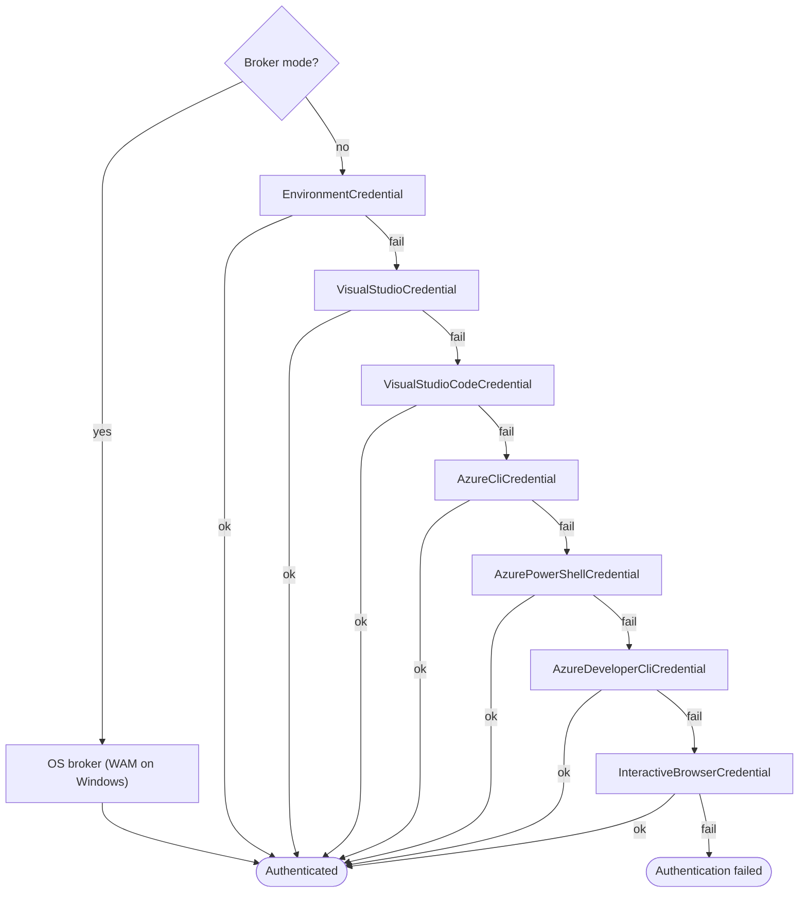
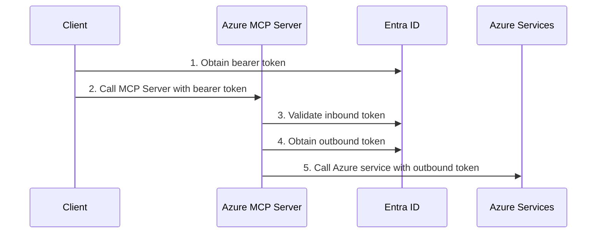

# Authentication in Azure MCP Server

Azure MCP Server runs in two transport modes — **stdio** (local) and **HTTP** (remote) — each with a different authentication model.

| | Stdio (local) | HTTP (remote) |
|---|---|---|
| **Who authenticates to Azure?** | The server itself, using your developer credentials | Depends on the outgoing auth strategy (see below) |
| **Inbound auth required?** | No — communication is over local process pipes | Yes — Entra ID bearer tokens protect every request |
| **Typical use** | IDE extensions, CLI, local agents | Cloud-hosted server shared by multiple clients/agents |

## Local Authentication (Stdio Transport)

When the server runs locally (the default), it authenticates directly to Azure services using credentials available on your machine.

### How credentials are resolved

The server uses a chain of credential providers. The first one that succeeds is used:

> [!NOTE]
> You can skip the chain and pin a specific credential by setting the `AZURE_TOKEN_CREDENTIALS` environment variable to the credential name. For example, to use only Azure CLI: `AZURE_TOKEN_CREDENTIALS=AzureCliCredential`.

> [!TIP]
> In VS Code, run **Azure: Sign In** from the Command Palette (ctrl+shift+p) to authenticate quickly.

### Broker mode

Set `AZURE_MCP_ONLY_USE_BROKER_CREDENTIAL=true` to skip the chain entirely and use the OS authentication broker (Web Account Manager on Windows). On unsupported operating systems it falls back to browser-based login.

### RBAC

Regardless of which credential is used, the authenticated identity must have the appropriate Azure RBAC roles on the target resources (for example, **Storage Blob Data Reader** for storage operations). See [What is Azure RBAC?](https://learn.microsoft.com/azure/role-based-access-control/overview) for details. For **User-Assigned Managed Identity**, also set `AZURE_CLIENT_ID` to the managed identity's client ID. If unset, System-Assigned Managed Identity is used.

### Choosing credentials by environment

| Environment | Recommended setup |
|---|---|
| **Local development** | Sign in with `az login`, VS Code Azure extension, or Azure PowerShell. The chain picks it up automatically. |
| **CI / CD pipelines** | Set `AZURE_CLIENT_ID`, `AZURE_CLIENT_SECRET`, and `AZURE_TENANT_ID` environment variables (service principal). |
| **Production (hosted)** | HTTP transport is recommended for production hosting — see Remote [Authentication (HTTP Transport)](#remote-authentication-http-transport). If STDIO is required, set AZURE_TOKEN_CREDENTIALS=prod to restrict the chain to Environment, Workload Identity, and Managed Identity credentials only — no interactive browser fallback. |

---

## Remote Authentication (HTTP Transport)

When the Azure MCP Server is hosted remotely (for example, on Azure Container Apps) using HTTP transport, authentication operates in two layers:

1. **Inbound authentication** — the client authenticates to the Azure MCP Server
2. **Outbound authentication** — the Azure MCP Server authenticates to downstream Azure services

> [!TIP]
> Want to get started quickly? The [`azd` templates](#deploy-with-azd-templates) below automate the entire setup illustrated above.

### Inbound Authentication

Every incoming request must carry a valid Entra ID bearer token with the required claims in the `Authorization` header. The inbound token can be obtained in one of two ways depending on the OAuth flow the client uses:

| OAuth Flow | Inbound Authentication | Required Claim |
|---|---|---|
| [Authorization Code](https://learn.microsoft.com/entra/identity-platform/v2-oauth2-auth-code-flow) | **Delegated** — a user signs in and obtains a bearer token | `Mcp.Tools.ReadWrite` scope |
| [Client Credentials](https://learn.microsoft.com/entra/identity-platform/v2-oauth2-client-creds-grant-flow) | **Application** — an application obtains a bearer token (no user involved) | `Mcp.Tools.ReadWrite.All` role |

> [!NOTE]
> The inbound authentication is determined entirely by the OAuth flow the client uses — the Azure MCP Server validates the incoming token and required claim but does not control how it is obtained.

### Outbound Authentication

The `--outgoing-auth-strategy` flag (`UseOnBehalfOf` or `UseHostingEnvironmentIdentity`) is passed when starting the Azure MCP Server and controls how it obtains outbound tokens to access downstream Azure services:

| Outbound Authentication | Behavior |
|---|---|
| **On-Behalf-Of** (`UseOnBehalfOf`) | Azure MCP Server exchanges the inbound user bearer token for a new token to access the downstream service |
| **Hosting Environment Identity** (`UseHostingEnvironmentIdentity`) | Azure MCP Server uses the hosting environment identity (typically a Managed Identity) to obtain a token to access the downstream service |

> [!NOTE]
> If `--outgoing-auth-strategy` is not specified, the server defaults to **On-Behalf-Of** .

### Supported Authentication Combinations

Use the following to verify your chosen inbound and outbound combination is supported:

| Inbound Authentication | Outbound Authentication | Supported |
|---|---|---|
| Delegated | On-Behalf-Of | ✅ |
| Delegated | Hosting Environment Identity | ✅ |
| Application | Hosting Environment Identity | ✅ |
| Application | On-Behalf-Of | ❌ Application bearer token carries no user identity, so there is nothing to exchange in an On-Behalf-Of flow |

### Choosing an Outbound Authentication Strategy

The right strategy depends on your security, auditing, and deployment requirements:

| | On-Behalf-Of | Hosting Environment Identity |
|---|---|---|
| **Per-user RBAC** | Yes | No — shared identity |
| **Audit trail** | Per-user | Server identity only |
| **Inbound auth type** | Delegated only | Delegated or Application |
| **Setup complexity** | Higher | Lower |
| **Best for** | Multi-tenant / enterprise / compliance-sensitive scenarios | Single-team or single-client-application scenarios |

### Deploy with azd Templates

Configuring Entra ID app registrations, scopes, roles, and hosting infrastructure manually is complex. The following Azure Developer CLI (`azd`) templates automate the entire setup including deploying Azure MCP Server to Azure Container Apps:

| Template | Outbound Strategy | Client (Agent) |
|---|---|---|
| [**azmcp-obo-template**](https://github.com/Azure-Samples/azmcp-obo-template) | On-Behalf-Of | Foundry Agent, Copilot Studio, C# Client |
| [**azmcp-foundry-aca-mi**](https://github.com/Azure-Samples/azmcp-copilot-studio-aca-mi) | Hosting Environment Identity | Foundry Agent |

Each `azd` template provisions:

- Entra ID app registration(s) with the correct scopes and roles
- Managed identity with appropriate RBAC assignments
- Azure Container App configured to run the Azure MCP Server with all required environment variables and server flags